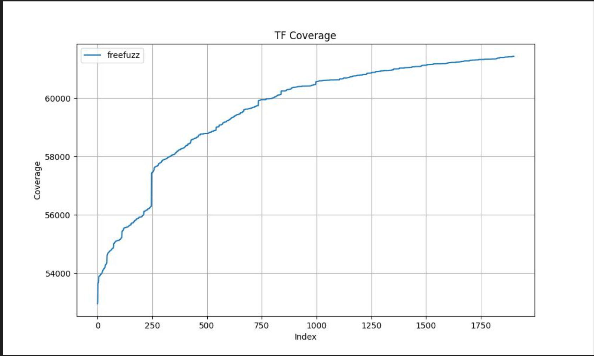
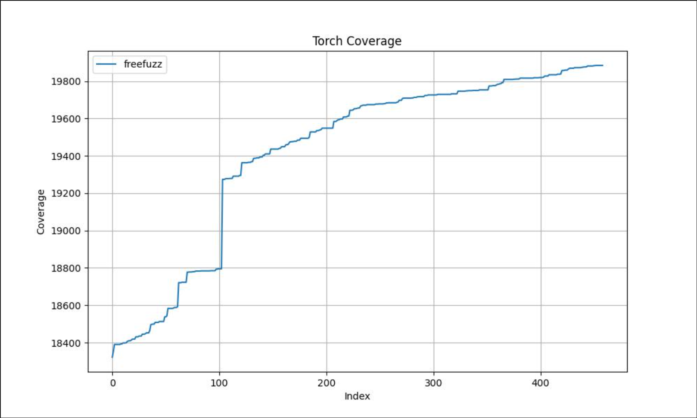

## FreeFuzz+DCOV

> FreeFuzz supports only TensorFlow and PyTorch

### Coverage curve of TensorFlow 

### Coverage curve of PyTorch

### Description

FreeFuzz is an API Fuzzer that pre-collects a large number of API specifications for TensorFlow and PyTorch, distinguishing them by API names. The horizontal axis of the coverage curve chart represents the ID of APIs, with its growth indicating the cumulative testing of different APIs. The vertical axis is the basic block coverage count. These curves reveal the process in which FreeFuzz achieves an increasingly higher total coverage as it tests more different APIs for TensorFlow and PyTorch.

